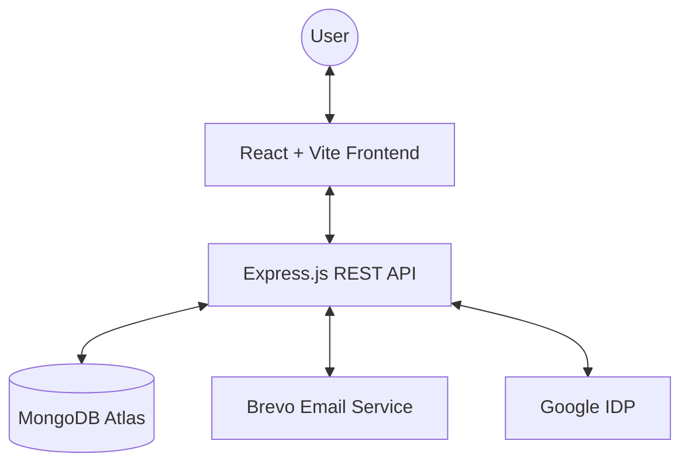

# 🏗️ MODSSER ENTERPRISES - Construction Website

[](https://reactjs.org/)
[](https://vitejs.dev/)
[](https://tailwindcss.com/)
[](https://nodejs.org/)
[](https://expressjs.com/)
[](https://www.mongodb.com/)

> A premium, high-performance construction business platform built with the MERN stack. Designed for visual excellence and seamless user experience.

---

## ✨ Key Features

- **💎 Premium UI/UX**: Modern dark theme with smooth glassmorphism and Framer Motion animations.
- **📱 Ultra Responsive**: Fluid experience across mobile, tablet, and high-res desktops.
- **🛠️ Service Showcase**: Categorized presentation of construction services and project details.
- **🔐 Secure Admin Panel**: Full-featured dashboard for content management and inquiry tracking.
- **⚡ SEO Supercharged**: Built-in meta optimization, Schema markup, and automated sitemap generation.
- **📧 Smart Communications**: Automated email notifications via Brevo API.
- **🔑 Advanced Auth**: Secure Google OAuth integration and JWT-based session management.

---

## 🏗️ Architecture Overview



---

## 🛠️ Technology Stack

| Layer | Technologies |
| :--- | :--- |
| **Frontend** | React 18, Vite, Tailwind CSS, Framer Motion, Axios, React Hook Form |
| **Backend** | Node.js, Express.js, JWT, BcryptJS, Helmet, CORS |
| **Database** | MongoDB (Mongoose ODM) |
| **Integrations** | Google OAuth 2.0, Brevo (Email), Vercel (Frontend), Render (Backend) |

---

## 📁 Project Structure

```text
MODSSER-ENTERPRISES-Construction-Website/
├── 🌐 Frontend/          # React Single Page Application
│   ├── src/
│   │   ├── components/  # Atomic UI components
│   │   ├── pages/       # High-level page views
│   │   ├── context/     # Global state management
│   │   └── utils/       # Helper functions
│   └── public/          # Static assets & media
└── ⚙️ Backend/           # RESTful API Service
    ├── controllers/     # Business logic
    ├── models/          # Database schemas
    ├── routes/          # API endpoint definitions
    └── middleware/      # Auth & Security layers
```

---

## 🚀 Getting Started

### 1️⃣ Clone the Repository
```bash
git clone https://github.com/your-username/MODSSER-ENTERPRISES-Construction-Website.git
cd MODSSER-ENTERPRISES-Construction-Website
```

### 2️⃣ Configure Backend ⚙️
1. Go to `Backend/` and install dependencies: `npm install`
2. Create `.env` and add:
   ```env
   MONGODB_URI=your_mongodb_uri
   JWT_SECRET=your_secret_key
   BREVO_API_KEY=your_key
   FRONTEND_URL=http://localhost:5173
   ```
3. Launch: `npm run dev`

### 3️⃣ Launch Frontend 🌐
1. Go to `Frontend/` and install dependencies: `npm install`
2. Launch dev server: `npm run dev`

---

## 📜 License
Distrubuted under the **ISC License**. See `LICENSE` for more information.

---
<p align="center">
  <b>Built with ❤️ by MODSSER ENTERPRISES Team</b>
</p>
